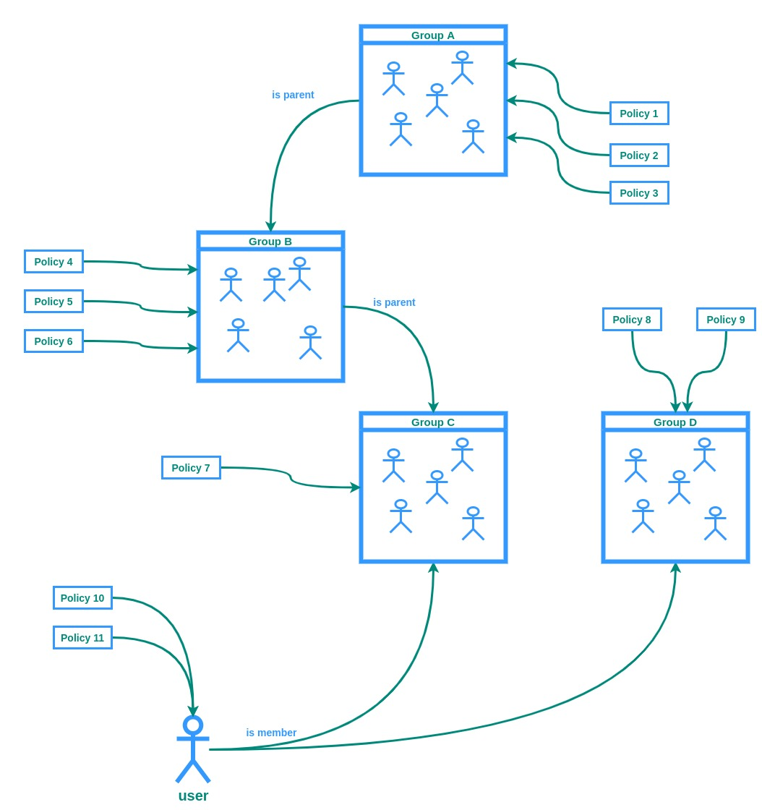
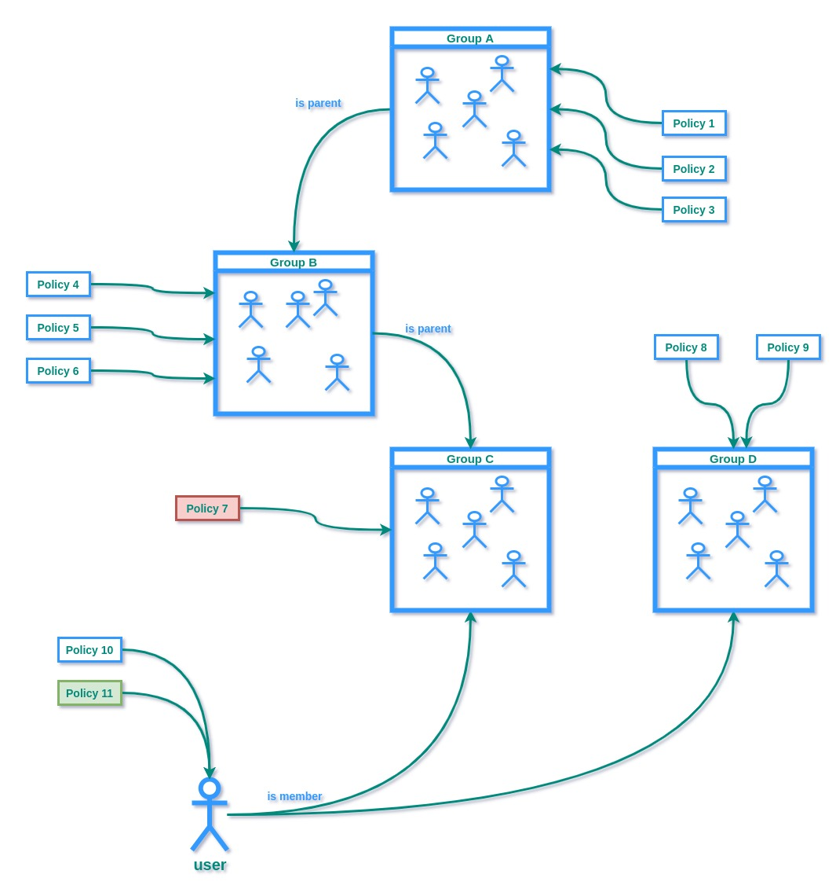
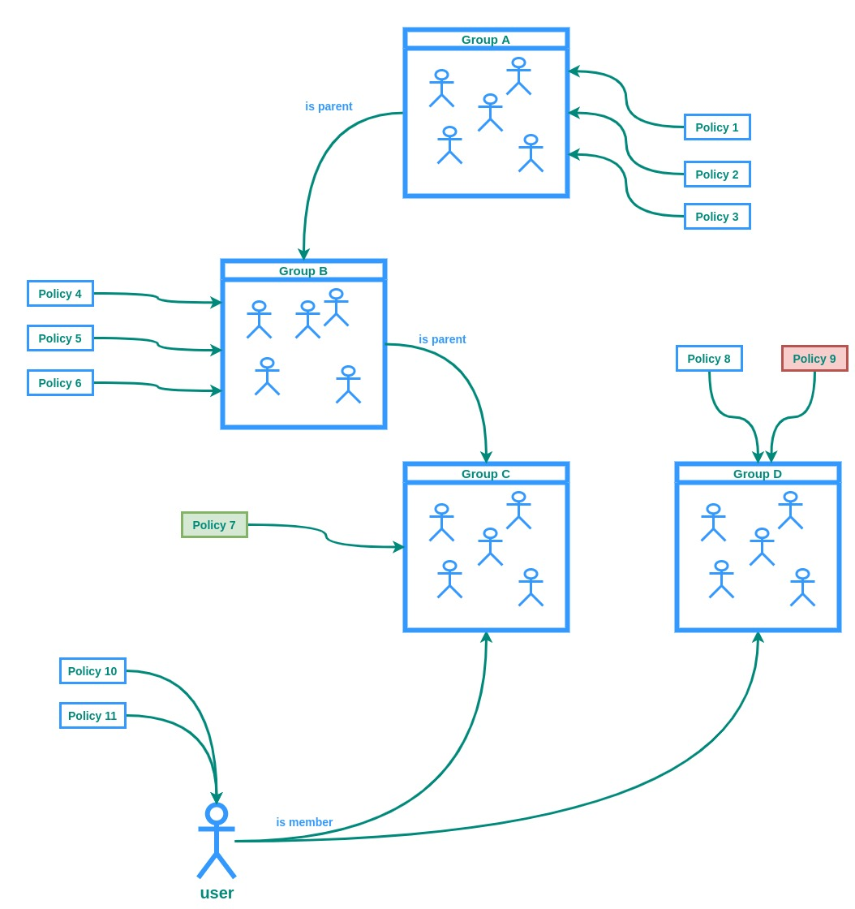

## Simple Summary
Identity and Access control management for Mainflux users and Things. Mainflux IoT platform uses `Auth` service for access control and entity management is based on ownership.
To support more advanced access control and shared control between group members, as well as user roles with different permissions, `Auth` service needs to be enriched with 
policies and roles to support such sophisticated access control.

## Abstract
Currently, `Auth` service is used to issue Auth Keys for the users and for handling Groups API for both Users and Things. When a user is using Things and Channels API, the actual authorization is done on the service layer accessing only those entities owned by the user. This is not practical because different stages of access control are scattered between
multiple services with no defined flow. The main goal of this paper is to specify desired flow for access control with simplicity and efficiency in mind. It's important that
access control is reliable, quick, and works correctly. For that reason, the initial version of this specification will introduce some constraints regarding Groups and access
rights evaluation. This means that the entire access control mechanism needs to be redesigned and reimplemented. The purpose of this paper is to specify a new architecture and propose an implementation that addresses the aforementioned challenges.

## Motivation
There are two main authentications and authorization flows:
1) Users authentication and authorization
2) Things authentication and authorization

Currently, all the user actions rely on ownership bases - the user can access only those entities owned by him. In the real-world use-cases, the one will usually want to be able to share access with other users, but also prevent other users from accessing or changing sensitive or important information. Also, users can't send or receive messages at the moment. To do that, you need to create a Thing, connect it to the Channel, and send a message using that Thing. That's complicated and impractical for the users that, say, want to send some commands to their devices.

Things authentication and authorization rely on things interconnection using Channels. This is fine, but it does not allow fine-grained access control such as allowing things to only publish or only subscribe, or to access only a specific topic rather than any topic on the given Channel. Also, as of the introduction of Groups, the Channel concept lost its purpose. Channels are nothing but simplified Thing Groups (Groups without hierarchy).

## Specification
Access control needs to be fast. Since Things can be sending messages at the rate of thousands of messages per minute, and each message needs to be authorized, authorization is the most frequently used operation in the system and will become a performance bottleneck if not implemented with that in mind. This means that, no matter how fast access control evaluation is, we'll need to use caching. That also implies some other compromises that will be addressed in the following sections. In the following chapters, we'll discuss different aspects of the access controls and propose solution architecture design.

### Access control and Groups
Access control is very tightly related to entity groups. Group concept is natural - it is used to join entities, usually by some criteria. There are two types of Groups - Things and Users groups. For example, one can create a Group of Things that represent one room. Please note that group membership is explicit - you need to add Things or Users to the group. There is implicit grouping such as "all Things with metadata field A that has value B" or "all users with a name that starts with 'John'". The groups are organized in hierarchies, forming tree-like structure. While groups can simply be used for semantic organization and representation of entities in the system, it makes sense to use them for access control. From now on, in this document Role and Group terminology will be used interchangeably.

### Roles and RBAC
When talking about access control, the two most common approaches are RBAC and ABAC. While the ABAC provides more fine-grained access control and many great features, RBAC is a more natural approach when it comes to access controls for users. Roles are nothing but artificial attributes attached to the user for the sole purpose of access control. Mainflux platform has a concept of groups explained in the previous chapter. Roles and groups, from the access control standpoint, can be merged: Role = Group. The same goes for Things groups.

### Hierarchy
In the initial implementation of this MIP - The group hierarchy will be ignored. Only the direct group membership will be taken into account when evaluating access control rules. **The sequel MIP addressing this issue will be created to introduce hierarchy.**

### Policies
<!-- How does policy look like? How to assign policies? Policy-role relation. -->
The policies are central new entities around which access control is going to be organized. Mainflux Policy is a new entity that consists of the Rules and Constraints. A Policy can be assigned to User, Thing, or Group. The User, Thing, or Group can have 0 or multiple policies assigned to them. Policies for a single entity are evaluated in the following order:
    1) Policies attached to the entity
    2) Policies attached to the groups entity is a direct member of
    3) Policies attached to the groups in that are higher in hierarchy
In the other words, policies are evaluated from the bottom up (in the sense of entity hierarchy defined by groups).

#### Evaluation
The result of policy chain evaluation can be one of two states: `allowed` or `forbidden`.
Policy is evaluated as `allowed` if **all** the matching Rules are evaluated successfully.
Policy is evaluated as `forbidden` if **any** the matching Rules are evaluated unsuccessfully.
If there is no matching rules, the next Policy in the chain is taken for evaluation.
If there is no matching rules in the entire chain, policy is evaluated `forbidden`.

Let's take a look at the couple of examples:

In this example, there is no policy with rules that match the request. The result is `forbidden`.

In this example, **Policy 11** allows the action, and **Policy 7** forbids it. The result of evaluation is `allowed`. The reason: policy that's directly attached to the entity has higher priority than policies attached to its groups. This mechanism is powerful because it allows access control override but also can be dangerous if not applied properly.

In this example, there is no direct policy that matches the provided criteria. For that reason, Groups are taken in account. **Policy 7**, that's attached to the Group C allows access, while **Policy 9** of Group D does not. The result is `forbidden`. On the same hierarchy level, there **must be at least one policy that allows and no policy that forbids access** to evaluate positively. In the other words, if there is a singe rule that evaluates as `forbidden`, the entire request is evaluated as `forbidden`, respecting the hierarchy when it comes to evaluation order (entity -> groups -> ancestor groups).

Rules are the core of the policy. Each policy has at least one rule and each rule belongs to exactly one policy.

### Rules

### Caching - client or server-side

### ABAC

## Rationale
The rationale fleshes out the specification by describing what motivated the design and why particular design decisions were made. It should describe alternate designs that were considered and related work, e.g. how the feature is supported in other languages.

## Backwards Compatibility
All MIPs that introduce backwards incompatibilities must include a section describing these incompatibilities and their severity. The MIP must explain how the author proposes to deal with these incompatibilities. MIP submissions without a sufficient backwards compatibility treatise may be rejected outright.

## Test Cases
Test cases for an implementation are mandatory for MIPs that are affecting consensus changes. Other MIPs can choose to include links to test cases if applicable.

## Reference Implementation
An optional section that contains a reference/example implementation that people can use to assist in understanding or implementing this specification.  If the implementation is too large to reasonably be included inline, then consider adding it as one or more files in `../assets/mip-####/`.

## Security Considerations
All MIPs must contain a section that discusses the security implications/considerations relevant to the proposed change. Include information that might be important for security discussions, surfaces risks and can be used throughout the life cycle of the proposal. E.g. include security-relevant design decisions, concerns, important discussions, implementation-specific guidance and pitfalls, an outline of threats and risks and how they are being addressed. MIP submissions missing the "Security Considerations" section will be rejected. An MIP cannot proceed to status "Final" without a Security Considerations discussion deemed sufficient by the reviewers.

## Copyright
Copyright and related rights waived via [CC0](https://creativecommons.org/publicdomain/zero/1.0/).